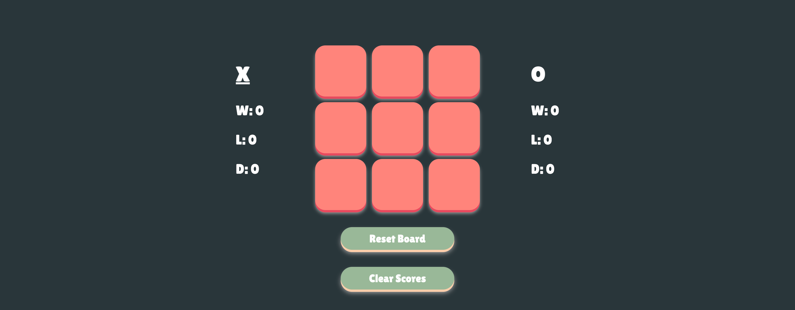

# Tic-Tac-Toe
This is an attempt to create a digital imitation of a classic game. No need for downloads or creating accounts. Just copy and paste this [link](https://t-hendricks.github.io/tic-tac-toe/) to your favorite browser, or type in the address [t-hendricks.github.io/tic-tac-toe/](https://t-hendricks.github.io/tic-tac-toe/) into your mobile device browser and play on the go. 

## Current Features
- **Interactive Elements:** Clicking / tapping each tile will alternate the state of the game for each player.
- **Audio/Visual Feedback:** Each sound and visual cue informs the players when someone has won, lost, tie, or change turns thoughout the game.
- **Stat Tracker:** For the competitors, multiple games can be played to keep a score count for each game session with a reset-board button to start a new game.
- **Clean Slate:** No need to refresh the page or open a new tab to reset stats. It is as simple as clicking the clear scores button.
## Technologies Used
- ### Version Control:
    - Git - local tracking
- ### Developer Tools:
    - Mac Terminal - CLI
    - Visual Studio Code - text editor
    - Google Chrome Developer Tools - testing / debugging
- ### Programming Languages:
   - 
   - 
    - 
## Installation
To set up the app locally on your own system:
1. Fork this [repository](https://github.com/t-hendricks/tic-tac-toe)
2. Copy the link [here](https://github.com/t-hendricks/tic-tac-toe.git) or from the green Code combo button, then in your terminal using either git bash or linux, clone this repo with copied link:
```
git clone <https://github.com/user/repo>
```
3. Then open the repo in a text editor or IDE
